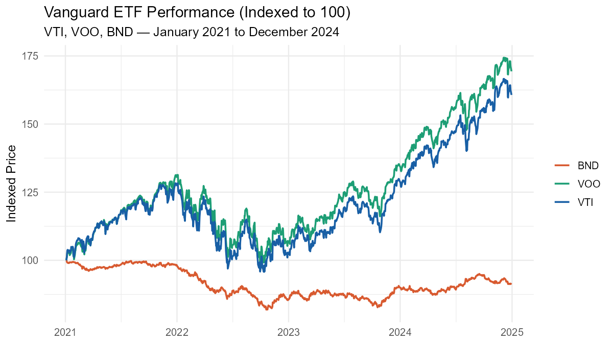
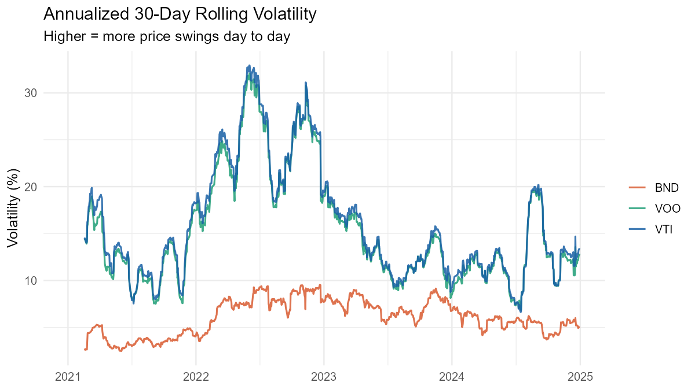
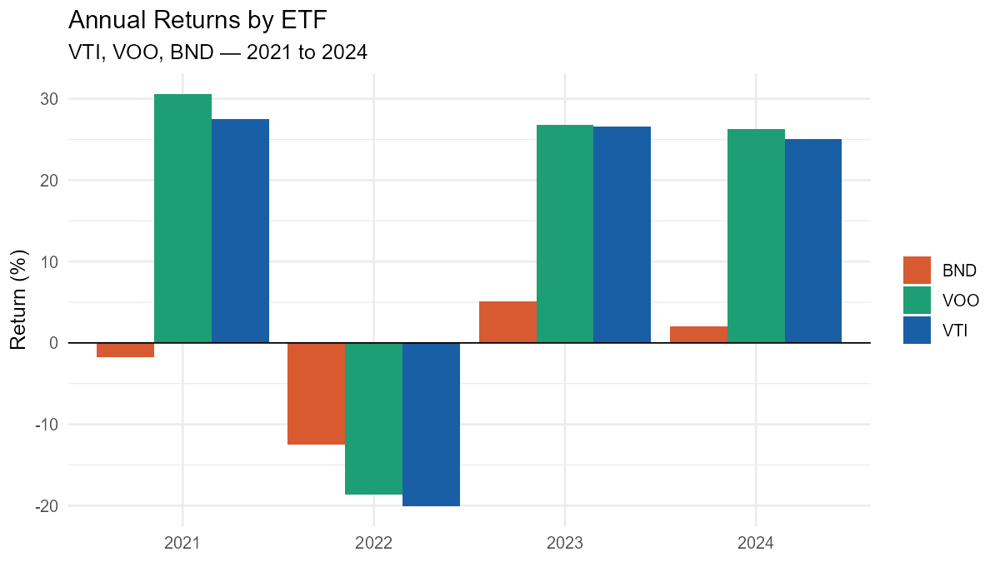

# Vanguard ETF Performance Analysis (2021–2024)

A SQL and R analysis of three Vanguard ETFs — VTI (total market), VOO (S&P 500), 
and BND (bonds) — across a four-year period that included aggressive Fed rate hikes, 
a broad market selloff, and a strong equity recovery.

## Key Findings

- **2022 was the worst year across all three funds.** VTI fell 20%, VOO fell 18.7%, 
  and BND fell 12.5% — driven by the fastest Fed rate hiking cycle since the 1980s.
- **Equities recovered fully; bonds did not.** VOO and VTI posted 26%+ returns in both 
  2023 and 2024, more than erasing 2022 losses. BND returned to positive growth but 
  had not recovered its lost principal by end of 2024.
- **VOO and VTI are highly correlated.** The S&P 500 and total US market track closely 
  because large-cap stocks dominate the total market index.
- **BND volatility persisted longer than equity volatility.** Bond prices remain 
  sensitive to rate expectations even after equity markets stabilized.

## Figures




## Methods

- **Data:** Daily OHLCV pricing data pulled via `yfinance` for 2021–2024 (~1,004 
  trading days per ticker)
- **Storage:** Ingested into a SQLite database using SQLAlchemy
- **SQL:** Aggregation, window functions (LAG, FIRST_VALUE, LAST_VALUE, rolling AVG), 
  and CTEs to compute summary statistics, annual returns, rolling averages, and 
  daily return series
- **Visualization:** R with ggplot2 and zoo for rolling volatility calculations

## Reproducing This Analysis

1. Install Python dependencies: `pip install yfinance pandas sqlalchemy`
2. Run `python ingest.py` to build the SQLite database
3. Run `python queries.py` to execute SQL queries
4. Open `etf-sql-R` as an R project and run `scripts/00_setup.R` then `scripts/01_plots.R`

## Repository Structure

```
etf-sql-analysis/
├── ingest.py
├── queries.py
├── check.py
├── etf_analysis.db
├── sql/
│   ├── 01_aggregation.sql
│   ├── 02_annual_returns.sql
│   ├── 03_rolling_avg.sql
│   └── 04_volatility.sql
└── etf-sql-R/
    ├── scripts/
    │   ├── 00_setup.R
    │   └── 01_plots.R
    └── figures/
        ├── indexed_performance.png
        ├── rolling_volatility.png
        └── annual_returns.png
```